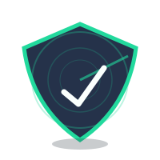

  

# NEXTLAYERSEC 🔐  
*Cybersecurity frameworks, blue team tools, and practical labs — all in one place.*

---

## 🚀 Quick Links
- 🌐 Website: https://nextlayersec.io
- 🔗 LinkedIn: https://www.linkedin.com/in/matthewlevorson/
- 🧑‍💻 GitHub: https://github.com/Blackvectra

---

## 🧭 What’s Here
This hub links out to focused repos so nothing overlaps. Each repo has a clear purpose:

### 🏗 Frameworks & Guidance
- **Cybersecurity Guides** → blue team playbooks, detection workflows, purple-team labs, TI docs  
  https://github.com/Blackvectra/cybersecurity-guides

### 🧪 Labs & Writeups
- **CyberSecurity Lab Vault** → curated labs, CTF solutions, pentest projects  
  https://github.com/Blackvectra/CyberSecurity-lab-vault  
- **CTF Writeups** → challenge notes, payloads, flags  
  https://github.com/Blackvectra/ctf-writeups  
- **Ethical Hacking Lab** → full offensive lab environment  
  https://github.com/Blackvectra/ethical-hacking-lab  
- **Infra-Sec Lab** → home lab: Defender, OPNsense, VLANs, SIEM  
  https://github.com/Blackvectra/infra-sec-lab

### 📓 Notes & Learning
- **NextLayerSec Notes** → CTF, college, cert, and life lessons  
  https://github.com/Blackvectra/nextlayersec-notes  
- **Certification Tracker** → progress on current & future certs  
  https://github.com/Blackvectra/certification-tracker

### 🛠 Tools (builds & forks)
- **Vulnwatch** → lightweight vuln tracking (private for now)  
  https://github.com/Blackvectra/Vulnwatch  
- **ThreatFeedCollector** → open‑source threat intel feed aggregator  
  https://github.com/Blackvectra/threatfeedcollector  
- **osint-scrub-kit** → OSINT exposure scrubber  
  https://github.com/Blackvectra/osint-scrub-kit

> More tools live in their own repos to keep codebases clean and versioned.

---

## 🧱 Frameworks Focus (site sections)
- **NIST CSF** – identify / protect / detect / respond / recover  
- **MITRE ATT&CK** – map detections to real attacker TTPs  
- **ISO/IEC 27001** – ISMS foundation  
- **IRS Pub 1075** – safeguarding FTI in U.S. gov environments  

> See details and docs in: https://github.com/Blackvectra/cybersecurity-guides/tree/main/frameworks

---

## 🤝 Contributing
Issues & PRs welcome across repos. This hub keeps everything discoverable.

---

  Built by <b>Blackvectra</b> • <a href="https://nextlayersec.io">nextlayersec.io</a>

